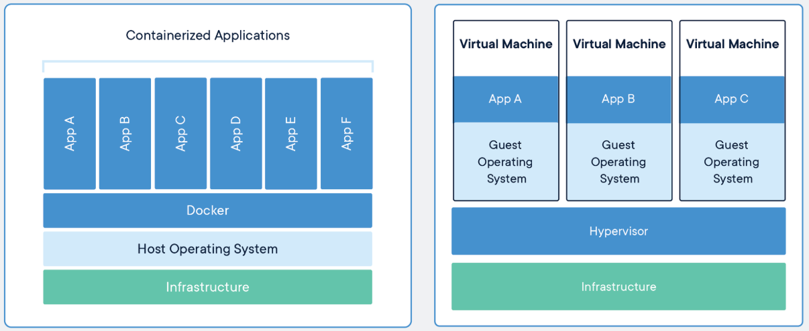
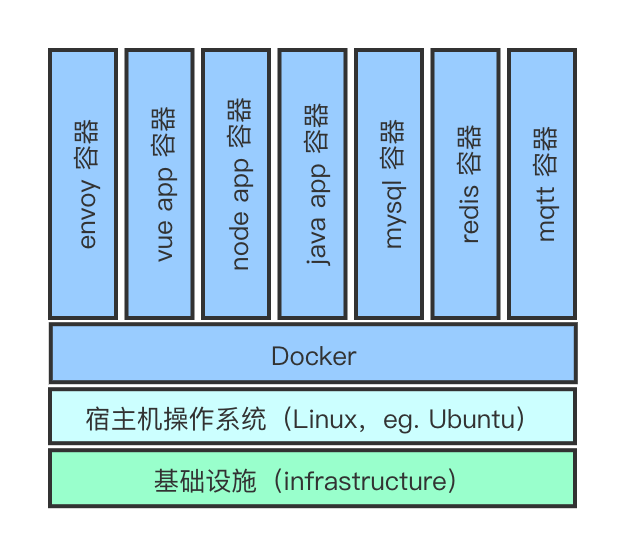

# docker 快速入门指南

[TOC]

## 0. 简介

本文档不是一篇 docker 的完全手册，而更倾向于任务驱动型的快速指南 + 简单的原理解说，旨在帮助入门用户快速建立 docker 的基本概念、使用逻辑、解决常用问题、并具备一定的自主分析的能力。

本文档不能取代规范、全面的学习，以下几本参考书比较完整的介绍了 docker 的使用。

> 参考书：
>
> - [Docker -- 从入门到实践](https://yeasy.gitbooks.io/docker_practice/)
> - [第一本Docker书（修订版）](./第一本DOCKER书 修订版.pdf)
> - [Docker 官方文档（英语）](https://docs.docker.com/)


## 1. docker是什么？

从官方文档到各种教程都没有给 Docker 一个精确的定义。大家分别从 Docker 的发展历史、Docker 的应用范围、Docker 和 VM（虚拟机）之间的对比等几个方面来**描述** Docker，但从来没有精确地定义过 Docker。

从一个 Docker 使用者（应用开发人员、运维人员）的角度来看，需要从以下几个方面来理解它：

### 1.1 docker 和 VM（虚拟机）

- docker 从行为上非常类似于 VM，它们都是运行在宿主机上相互隔离的独立空间中；

- 在使用上 docker 和 VM也非常类似，都用于**部署**独立运行的“程序”（更精确的说法是：进程），这些“程序”相互隔离，也与宿主机隔离，各自拥有自己的运行环境（如：环境变量、软件环境等）。

但是，docker 和 VM 有着本质上的不同。下面这张图，完美解释了 docker 和 VM 之间的区别：



- docker 是操作系统虚拟化；VM 是硬件虚拟化。
- docker 虚拟化出来的操作系统和宿主机相同；VM 在虚拟硬件上可以安装任何操作系统。
  - 由于 docker 是在 Linux 容器化技术上发展而来的，因此早期只能是 Linux。无论是 Windows 还是 macOS，都是先安装了一个 Linux 虚拟机，然后在这个虚拟机上安装 docker ，因此 docker 中的操作系统只能是 Linux。
  - 随着 Microsoft 发布了 windows 容器（windows 10 内置），我们也可以使用 windows 原生容器来运行 windows 应用。
- docker 的启动要比 VM 快得多，而且消耗的资源要小得多。
- docker 的性能更好，接近原生系统的性能。

### 1.2 docker 的使用范围

初次接触 docker，不免产生这样的疑问：VM 可以让我们在 windows 上运行 Linux，在 macOS 上运行 windows；而 docker 只能在 Linux 上运行 Linux，这有什么用处呢？

#### 1.2.1 快速、一致、可靠地部署软件

Linux 以灵活性著称，它保持了高度的可定制性。但是，灵活性带来的是软件部署的复杂性、不一致性、以及可靠性的降低。

- 作为 Linux 的新手，都无数次遇到：明明是按照网上教程进行部署的，但是就是不成功，还是需要花大量的时间去搜索解决方案。即使是 Linux 的资深专家，也不能保证一次性部署成功。

- 安装没有预编译版本的软件，配置编译环境就是一件让 Linux 专家也不愿意做的事儿。
- ......

**docker 解决方案：**

- 在 docker 的世界里，只需要成功安装一次，就可以生成一个镜像，可以把安装镜像拷贝到任意机器中，只需运行该镜像就可以了，无须重复部署。
- 在 docker 的世界里，有一个名为：https://hub.docker.com 的公共镜像仓库，无数人为它提供软件镜像，大多数软件，无须安装，只需要下载改镜像，并运行就可以了。

#### 1.2.2 运行环境隔离

在开源的世界里，不同的软件需要依赖于（dependent）同一软件的不同版本，或者同一软件的不同配置是非常常见的现象。然而，在开源的世界里，，并不能保证软件和软件之间不冲突，也不保证同一软件的不同版本之间兼容。例如：python 2 和 python 3 并不兼容；node、vue 的不同版本也不能保证前后向兼容。由于历史的积累，老的代码可能需要老的运行环境，而新的代码势必要使用新的运行环境来保证新的特性。

虽然各个软件为版本升级、迁移，都提出类似的解决方案，例如：python 用 anaconda、node 用 nvm，但是没有一个统一、一致的方法。

**docker 解决方案：**

- 在 docker 的世界里，这个问题变得非常简单，为每个软件运行一个独立的 docker 容器就可以了。由于容器之间是隔离的，可以为每个软件部署独立的软件运行环境。

#### 1.2.3 使用 docker 后的软件部署架构

以一个前后端分离的软件系统为例，前端为：vue-ui，后端为：node + koa、spring boot，使用了 mysql、redis 数据库，并使用了 mqtt 消息队列服务的系统，其部署结构可能如下图所示：



- 上图列出的所有容器均有官方镜像
  - vue 运行环境可以使用 nginx 官方镜像，或者直接加载在 envoy 容器中
  - node 运行环境可以使用 PM2 官方镜像
  - java 运行环境可以使用 tomcat 官方镜像

- 使用 docker-compose 编写部署脚本，一条命令部署系统，非常方便研发团队统一开发环境，测试团队建立测试环境、以及实施团队部署到客户环境。

### 1.3 术语

- **镜像（image）：**
  - 镜像包含了容器运行时所需的程序、库、资源、配置等文件。
  - 从软件使用者角度来看，它类似于可执行文件，包含了软件执行所需的代码、数据、配置等。
  - 从软件开发者的角度来看，它类似于类定义。
  - 从 VM 使用者角度来看，它和 VM 镜像的作用是相同的，但是存取原理不一样。
  - docker 镜像是一个特殊的文件系统，由 docker 命令进行管理，用户并不能直接访问该文件系统。
- **容器（container）：**
  - 容器是镜像运行时的实体（实例）。
  - 容器可以被创建、启动、停止、删除、暂停等。
  - 从软件开发者的角度来看，它类似于类实例。
  - 一个镜像可以对应多个容器。
- **仓库（repository）：**
  - 用来集中存放镜像文件的地方，类似于 git 代码仓库。
  - 和 git 代码仓库类似，一个镜像可以有多个版本，称之为 tag（标签），用`<仓库名>:<标签>`来唯一确定一个镜像。


## 2. 安装、配置 docker

### 2.1 安装 docker

docker 安装很简单，可以参考[官方安装指南](https://docs.docker.com/get-docker/)。

#### 2.1.1 insight docker installation

- docker 从起源上来说是基于 Linux 的容器化技术发展而来的，因此，在 Linux 上安装 docker 是原生的。ubuntu 可以通过添加官方软件源来安装 docker。
- 在 windows、macOS 上通过 `Docker Desktop for Windows/Mac` 来安装 docker。该安装程序先安装 Linux 虚拟机，然后在虚拟机上安装 Linux 原生 docker，最后安装 desktop 应用来操控虚拟机中的 docker。
- windows 上安装 docker 又复杂一些
  - docker desktop for windows 上使用 Hyper-V 虚拟机，必须硬件开启 Hyper-V。
  - macOS Boot Camp 不支持 Hyper-V，无法成功安装启动 docker desktop for windows。
  - windows 10 (1607) 或 windows server 2016 以上版本，可以切换到 windows 容器，来运行 windows 应用。
  - windows 容器比较新，相关的应用镜像也很少，基本上需要靠自己来构建镜像。

### 2.2 使用 Docker Registry Mirror

#### 2.2.1 术语

- **registry：**为了方便大家共享镜像仓库，需要建立一个存储、管理、查找、下载镜像的服务，这个服务称之为 registry，类似于 github 之于 git。
- **Docker Registry：**docker 官方的 registry，地址为 https://hub.docker.com

#### 2.2.2 Docker Registry Mirror

Docker Registry 在国内访问非常慢，可以通过使用国内镜像来进行加速。docker 官方、Microsoft azure 云、网易云、有道云、七牛云均提供镜像服务。

推荐使用：

- Microsoft Azure：https://dockerhub.azk8s.cn，实测比官方镜像更稳定、快速。
- 官方镜像：https://registry.docker-cn.com，官方镜像，不用解释。
- 网易镜像：https://hub-mirror.c.163.com

设置方法，可以自行 baidu/google。

### 2.3 Docker ID

**Docker ID** 是用户访问 Docker Registry 的账号。不过 Docker Registry 是可以匿名访问的，如果不需要把自制镜像推送到 Docker Registry ，则无须注册、登录 Docker ID。


## 3. 获取、运行镜像

以获取、运行 MySQL 为例：

### 3.1 搜索 MySQL 镜像

到 https://hub.docker.com 去搜索 MySQL 镜像。

- 除了官方镜像（Offical Image）外，还有很多其它组织、个人提供的定制镜像，当然官方镜像是最可靠的。在搜索结果的右上角，标明了是否是 Offical Image。
- 镜像仓库中包括了多个版本的镜像，在 docker 中称之为 `tag`。在 `Tags` 标签下，可以浏览仓库里所有的镜像版本。
- 使用 `<仓库名>:<tag>` 来唯一标记某个镜像，例如：`mysql:5.7` 是 mysql 5.7 版镜像。
- `tag` 标记了一个镜像，而一个镜像可以对应多个 `tag`，它们并不是一一对应的关系。例如：`mysql:5.7` 和 `mysql:5` 是同一个镜像。
- `DIGEST` 和镜像之间是一一对应关系，它位于镜像信息的左下角。
- 不带 `tag` 的镜像引用，缺省对应 `:latest` 标签，例如：`mysql` 等同于 `mysql:latest`（注意，通过 `DIGEST`，可以发现 `mysql:latest` 与 `mysql:8.0.19`、 `mysql:8.0`、`mysql:8` 是同一个镜像）。

### 3.2 下载 MySQL 5.7 镜像

```bash
$ docker pull mysql:5.7 # 下载镜像
$ docker images # 浏览已经下载到本地的镜像
```

这个没啥好解释的。

### 3.3 运行 MySQL 5.7

```bash
$ docker run --name some-mysql -e MYSQL_ROOT_PASSWORD=my-secret-pw -d mysql:5.7
```

- 通常，如何运行一个镜像，可以在仓库的 `Description` 中找到
- 命令解释：
  - `run`：运行一个容器
  - `--name some-mysql`：命名该容器为 `some-mysql`，在后续命令中，可以通过容器名（`<container-name>`）来操作该容器，通常不需要对容器进行命名。
  - `-e MYSQL_ROOT_PASSWORD=my-secret-pw`：设置环境变量 `MYSQL_ROOT_PASSWORD` 为 `my-secret-pw`。通常，可以通过环境变量对容器进行初始化设置，例如：spring boot 中，环境变量配置的优先级高于配置文件，可以通过环境变量来改变缺省的数据库连接。这里，通过环境变量配置 MySQL 的 root 密码。
  - `-d`：在后台运行该容器。
  - `mysql:5.7`：运行的镜像。

#### 3.3.1 检查容器是否运行成功

```bash
$ docker ps -a # 列出所有容器
```

- `-a`：列出所有容器，无论是否是本用户创建的。
  - 在 Linux 上运行涉及到其它用户创建容器的命令，需要使用 `sudo`。

该命令可能的输出：

```
CONTAINER ID        IMAGE               COMMAND                  CREATED             STATUS              PORTS                 NAMES
b132028b32e9        mysql:5.7           "docker-entrypoint.s…"   7 minutes ago       Up 7 minutes        3306/tcp, 33060/tcp   some-mysql
```

- `CONTAINER ID - b132028b32e9`：容器 ID，全局唯一，可以通过 ID 来操控该容器。和 git 类似，一般来说，ID 的前 2 - 4 位就足以唯一确定这个容器了，因此在引用该容器时，只需要前 2 - 4 位就可以了。
- `IMAGE - mysql:5.7`：生成该容器的镜像名。
- `COMMAND - "docker-entrypoint.s..."`：该容器执行的命令，详见“insight docker run”。
- `CREATED - 7 minutes ago`：容器创建时间。
- `STATUS - Up 7 minutes`：容器当前状态，`Up` 表示该容器在后台运行；`Exit` 表示该容器已经退出。
- `PORTS - 3306/tcp, 33060/tcp`：容器使用的端口。
- `NAMES - some-mysql`：容器的名字，可以通过容器名来引用该容器。

#### 3.3.2 insight `docker run`

docker 镜像可以视为”一个应用软件及其运行环境的集合“；而运行一个 docker 镜像可以视为”在一个隔离的进程中运行该应用软件及其依赖软件包“。因此，镜像通常会指定在开始运行时自动启动的应用软件，就像操作系统启动时，会自动启动某些应用程序一样。可以通过 docker 命令 `history` 或 `inspect` 来查看容器到底启动了什么应用软件。

```bash
$ docker history mysql:5.7
IMAGE               CREATED             CREATED BY                                      SIZE                COMMENT
d5cea958d330        2 days ago          /bin/sh -c #(nop)  CMD ["mysqld"]               0B
<missing>           2 days ago          /bin/sh -c #(nop)  EXPOSE 3306 33060            0B
<missing>           2 days ago          /bin/sh -c #(nop)  ENTRYPOINT ["docker-entry…   0B
<missing>           2 days ago          /bin/sh -c ln -s usr/local/bin/docker-entryp…   34B
<missing>           2 days ago          /bin/sh -c #(nop) COPY file:3f9ea5eebe1c6044…   12.8kB
<missing>           2 days ago          /bin/sh -c #(nop)  VOLUME [/var/lib/mysql]      0B
<missing>           2 days ago          /bin/sh -c {   echo mysql-community-server m…   320MB
<missing>           2 days ago          /bin/sh -c echo "deb http://repo.mysql.com/a…   56B
<missing>           2 days ago          /bin/sh -c #(nop)  ENV MYSQL_VERSION=5.7.29-…   0B
<missing>           2 days ago          /bin/sh -c #(nop)  ENV MYSQL_MAJOR=5.7          0B
<missing>           2 days ago          /bin/sh -c set -ex;  key='A4A9406876FCBD3C45…   30.2kB
<missing>           2 days ago          /bin/sh -c apt-get update && apt-get install…   50.2MB
<missing>           3 weeks ago         /bin/sh -c mkdir /docker-entrypoint-initdb.d    0B
<missing>           3 weeks ago         /bin/sh -c set -x  && apt-get update && apt-…   4.44MB
<missing>           3 weeks ago         /bin/sh -c #(nop)  ENV GOSU_VERSION=1.7         0B
<missing>           3 weeks ago         /bin/sh -c apt-get update && apt-get install…   10.2MB
<missing>           3 weeks ago         /bin/sh -c groupadd -r mysql && useradd -r -…   329kB
<missing>           3 weeks ago         /bin/sh -c #(nop)  CMD ["bash"]                 0B
<missing>           3 weeks ago         /bin/sh -c #(nop) ADD file:003d2bac85e72555e…   55.3MB
```

- 注意第一行输出：`... CMD ["mysqld"]`，说明该镜像启动时，会自动执行 `mysqld`，也就是 MySQL 服务进程！

- docker 关于自动启动的设计比上述还略微复杂一点，事实上，自动启动命令有两个：第三行输出 `... ENTRYPOINT ["docker-entrypoint.sh"]` 也用于指定自动启动命令。`mysql:5.7` 镜像完整的自动启动命令为：`docker-entrypoint.sh mysqld`。这样的设计是有其特殊目的的，随后的章节我们会继续讨论这个话题。

#### 3.3.3 映射 MySQL 服务端口

使用 `docker ps -a` 命令可以看到 `some-mysql` 容器打开了两个端口：`3306/tcp, 33060/tcp`，显然这是 `mysqld` 使用的服务端口。但是请注意：该端口是容器内部端口，宿主机是无法直接访问到的（这个论断也不完全正确，这里暂时不讨论 docker network 的相关内容，后面的章节会进一步讨论），因此需要把容器内端口映射到宿主机。

```bash
$ docker run --name mysql-1 -p 4000:3306 -e MYSQL_ROOT_PASSWORD=root -d mysql:5.7
```

- 不能创建同名容器，此容器命名为 `mysql-1`。
- `-p 4000:3306`：将容器内部端口 `3306` 映射到主机端口 `4000`。

#### 3.3.4 测试 MySQL 5.7 服务

```bash
$ mysql -h 127.0.0.1 -P 4000 -u root -p
```

- mysql root 用户密码为：`root`
- 注意：不能使用 `localhost` 来进行连接，因为 `mysql` 对 `localhost` 连接使用了 unix socket：`/tmp/mysql.sock`，而这个套接字存在在容器内部，而不是宿主机上。

#### 3.3.5 数据持久化

**“数据持久化”**是一个专业术语，大白话就是：将数据存储在宿主机上。

容器是一个与宿主机隔离的进程，存储在容器内部的数据，当容器删除后也会删除。为了保证服务重启、迁移时数据不丢失（称之为：**持久化**），必须将数据存储在宿主机上。

持久化的原理很简单：将容器内的目录映射到宿主机的某个目录。

```bash
$ docker run -p 3306:3306 -e MYSQL_ROOT_PASSWORD=root -v /data/mysql:/var/lib/mysql -d mysql:5.7
```

- `-v /data/mysql:/var/lib/mysql`：将容器内的 `/var/lib/mysql` 目录映射到宿主机上的 `/data/mysql` 目录。由于 MySQL 的数据存储在 `/var/lib/mysql` 目录中，映射后就存储在宿主机的 `/data/mysql` 目录中。
- 容器停止、删除，均不会影响宿主机上的数据；重新部署容器，可以恢复以前的数据。
- 宿主机上的数据可以单独备份、恢复和迁移。
- 请注意：宿主机目录需要赋予容器启动用户读写权限。

> **“数据持久化”**应用范围很广，不仅仅用于保存用户数据，还常常用于：
>
> - 用宿主机上的配置文件取代容器内部的缺省配置文件，实现自定义配置。
> - 将宿主机上的源程序编译目录映射到容器内部，实现编译即发布的功能。

### 3.4 停止、删除容器

```bash
$ docker stop some-mysql mysql-1 # 停止 some-mysql mysql-1 容器
$ docker rm some-mysql mysql-1 # 删除 some-mysql mysql-1 容器
```

- 必须要先停止容器，才能删除

### 3.5 使用 docker-compose 启动 MySQL

启动容器的参数越来越长，容易发生输入错误或疏漏。`docker-compose` 是 docker 自带的**容器编排工具**，可以通过配置文件来启动一系列容器的工具。

> `docker-compose` 的配置文件采用了 `YAML` 格式，完整语法可以参考：[YAML 语言教程 - 阮一峰](https://www.ruanyifeng.com/blog/2016/07/yaml.html)

使用 `docker-compose` 启动 MySQL 的配置文件 `mysql.yml`：

```yaml
version: '3'  # docker-compose 版本，当然越新越好，目前最新版本为 '3'

services:     # 服务列表，可以支持启动多个容器
  mysql:      # 以下是 mysql 容器的配置项
    container_name: mysql-1
    image: mysql:5.7
    ports:
      - "3306:3306"
    environment:
      - MYSQL_ROOT_PASSWORD=root
    volumes:
      - ./data/mysql:/var/lib/mysql
```

`docker-compose` 启动、停止命令：

```bash
$ docker-compose -f mysql.yml up -d
$ docker-compose -f mysql.yml down
```

- `-f mysql.yml`：指定启动文件。如果不指定，`docker-compose` 会寻找当前目录下的 `docker-compose.yml` 作为配置文件。
- `up -d`：以后台运行方式启动。
- `down`：停止容器，并自动删除容器。


## 4. 进阶

上一节详细描述了如何部署一个容器化服务，从宿主机上访问该服务，并对容器化服务进行数据持久化。

但是，如果某个系统是由一组容器化服务构成的（通常都是这样的），上述的部署方式就不是最优的了。

按照上述的部署方式，需要将各个容器端口均映射到宿主机，容器之间通过宿主机端口相互访问，并对外提供服务。这样部署的缺点在于：

- 将内部服务暴露在外，削弱了安全性。
- 如果将容器组部署在多台机器上，容器相互之间的访问就与宿主机的 IP 相关，不能做到透明部署，削弱了部署的一致性和可靠性。
- 同理，在多台机器上部署容器组，数据持久化也与宿主机环境相关，削弱了部署的一致性和可靠性。

针对以上问题，docker 的解决方案是：引入网络层和数据持久层。也就是说：由 docker 构建透明的网络层和数据持久层，屏蔽 cluster 带来的部署复杂性。docker 的网络层和数据持久层对容器来说，是一个独立、完整的虚拟资源。

### 4.1 网络层


### 3.5 覆盖自动启动命令

有些情况下，并不需要执行镜像指定的自动启动命令，可以由命令行指定用户命令覆盖自动启动命令。

```bash
$ docker run -it --rm mysql:5.7 mysql -h 172.17.0.2 -u root -p
```


### 3.6 命令小结

| `docker run`                  | 解释                          |
| ----------------------------- | ----------------------------- |
| `--name container-name`       | 命名容器                      |
| `-p host-port:container-port` | 将容器 port 映射到宿主机 port |
| `-e env-variable=value`       | 指定环境变量                  |
| `-d`                          | 在后台运行容器                |
| `-it`                         | 与容器进行交互                |
| --rm                          | 当容器退出时，自动删除容器    |

